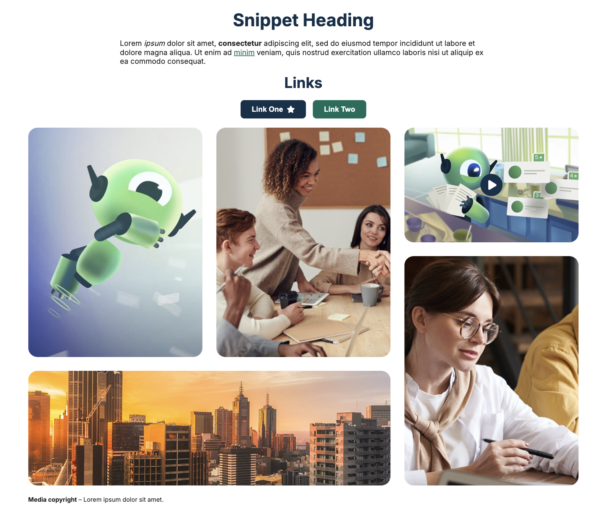
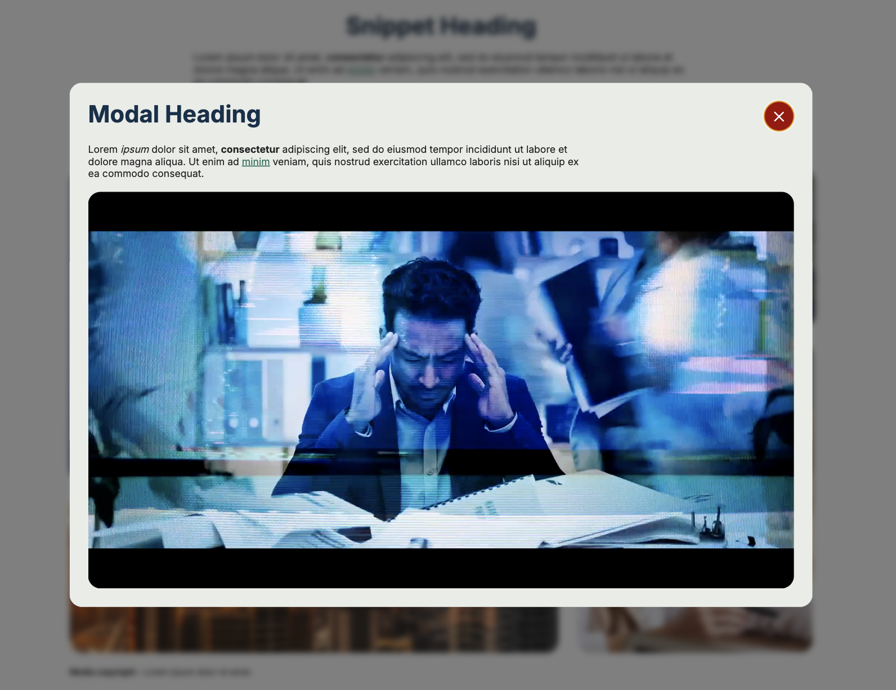

# Gallery Content Component

## Project Description

This project features a responsive gallery grid displaying five images arranged in a precise, fixed order.
Each image serves as a link, with one image featuring a play button overlay.

The component is reusable — both the set of images and their corresponding descriptions (for the main view and modal window) can be easily replaced.

Keyboard navigation is fully supported: users can navigate across the grid using the Tab key.
When a user clicks the play button, an accessible modal window opens, embedding a YouTube video that starts playing automatically.
The modal traps focus while open and can be closed via a close button or by pressing the Escape key, which also stops the video playback to ensure a clean user experience.

The gallery is optimized for modern browsers and devices, ensuring responsiveness, performance, and accessibility in line with WCAG 2.1 AA standards.

## Deploy

https://kristykov.github.io/responsive-gallery/

## Deployment Preview

## Technologies Used

- HTML
- SASS / SCSS
- JavaScript

## Project Structure

- `gallery/`
  - `assets/`
  - `css/`
    - `gallery.css`
  - `styles/`
    - `gallery.scss`
  - `tests/`
    - `modal.test.js`
  - `index.html`
  - `script.js`
  - `package.json`
  - `README.md`

## Installation

Clone the repository to your local machine using `git clone git@github.com:kristykov/responsive-gallery.git`

Install the necessary dependencies using `npm install`

To manually compile SCSS to CSS `npm run sass`

Run the app `npm run start`

To run tests `npm run test`
